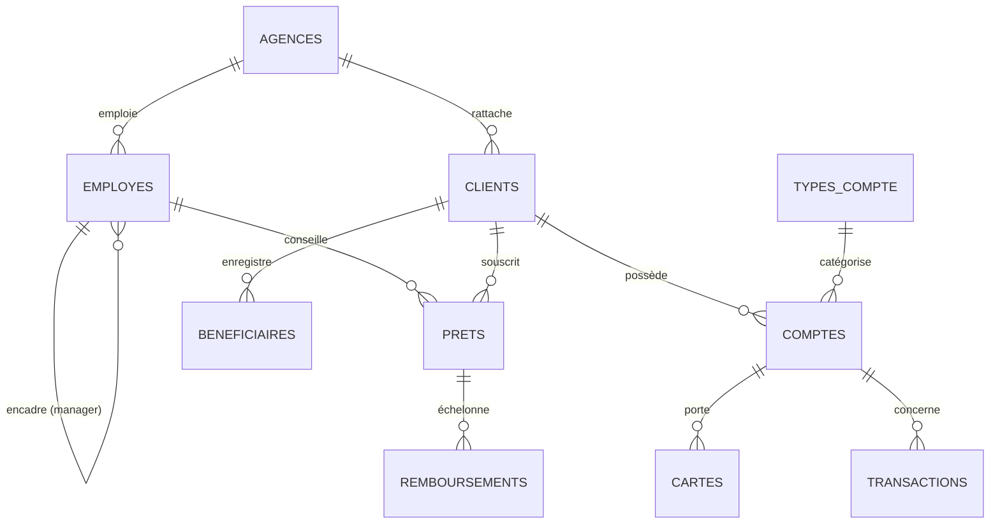

# 🏦 FinBank CI — Modèle de données

> Base de données pédagogique d'une banque numérique ivoirienne fictive.
> Sert de support unique aux 5 chapitres : **DDL · DML · DQL · DCL · TCL**.

---

## 1. Le contexte métier

**FinBank CI** est une banque de détail. Elle gère des **clients**, qui ouvrent
des **comptes** (de différents **types**), reçoivent des **cartes**, effectuent
des **transactions** (dépôts, retraits, virements, paiements) et contractent
parfois des **prêts** remboursés par **échéances**. Le tout est opéré depuis des
**agences** par des **employés** organisés en hiérarchie.

Devise par défaut : **XOF** (Franc CFA / FCFA).

---

## 2. Schéma relationnel (diagramme entité-association)

> 💡 Le diagramme se rend automatiquement sur GitHub/GitLab et dans VS Code
> (extension *Markdown Preview Mermaid*).

---

## 3. Dictionnaire des données

### `agences` — agences physiques *(12 lignes)*
| Colonne | Type | Contrainte | Description |
|---|---|---|---|
| `id_agence` | SERIAL | 🔑 PK | Identifiant auto |
| `code_agence` | CHAR(5) | UNIQUE, NOT NULL | Code interne (`AG001`) |
| `nom`, `ville`, `region` | VARCHAR | NOT NULL | Localisation |
| `telephone` | VARCHAR(20) | *nullable* | Contact |
| `date_ouverture` | DATE | DEFAULT today | Date de création |

### `types_compte` — référentiel *(5 lignes)*
| Colonne | Type | Contrainte | Description |
|---|---|---|---|
| `id_type` | SERIAL | 🔑 PK | Identifiant |
| `libelle` | VARCHAR(30) | UNIQUE | Courant, Épargne, … |
| `taux_interet` | NUMERIC(5,2) | CHECK 0–25 | % annuel |
| `frais_mensuels` | NUMERIC(10,2) | DEFAULT 0 | en FCFA |

### `employes` — personnel *(60 lignes)*
| Colonne | Type | Contrainte | Description |
|---|---|---|---|
| `id_employe` | SERIAL | 🔑 PK | Identifiant |
| `matricule`, `email` | — | UNIQUE | Identifiants métier |
| `salaire` | NUMERIC(12,2) | CHECK > 0 | Rémunération |
| `id_agence` | INT | 🔗 FK → agences | Affectation |
| `id_manager` | INT | 🔗 FK → employes | Supérieur (*nullable*) |

### `clients` — clients *(250 lignes)*
| Colonne | Type | Contrainte | Description |
|---|---|---|---|
| `id_client` | SERIAL | 🔑 PK | Identifiant |
| `sexe` | CHAR(1) | CHECK ('M','F') | Genre |
| `date_naissance` | DATE | CHECK majeur | ≥ 18 ans |
| `email` | VARCHAR(80) | UNIQUE *nullable* | Contact |
| `id_agence` | INT | 🔗 FK → agences | Agence de rattachement |

### `comptes` — comptes bancaires *(350 lignes)*
| Colonne | Type | Contrainte | Description |
|---|---|---|---|
| `id_compte` | SERIAL | 🔑 PK | Identifiant |
| `numero_compte` | VARCHAR(20) | UNIQUE | IBAN simplifié |
| `solde` | NUMERIC(15,2) | CHECK ≥ -50000 | Découvert autorisé 50 000 F |
| `statut` | VARCHAR(10) | CHECK | actif / bloque / cloture |
| `id_client` | INT | 🔗 FK → clients | Titulaire |
| `id_type` | INT | 🔗 FK → types_compte | Type |

### `cartes` — cartes bancaires *(280 lignes)*
| Colonne | Type | Contrainte | Description |
|---|---|---|---|
| `id_carte` | SERIAL | 🔑 PK | Identifiant |
| `numero_carte` | CHAR(16) | UNIQUE | Numéro PAN |
| `type_carte` | VARCHAR | CHECK | Visa / Mastercard / GIM-UEMOA |
| `plafond` | NUMERIC | CHECK > 0 | Limite de dépense |
| `id_compte` | INT | 🔗 FK → comptes | Compte associé |

### `beneficiaires` — bénéficiaires enregistrés *(200 lignes)*
| Colonne | Type | Contrainte | Description |
|---|---|---|---|
| `id_beneficiaire` | SERIAL | 🔑 PK | Identifiant |
| `numero_compte_externe` | VARCHAR(34) | NOT NULL | IBAN du bénéficiaire |
| `banque_externe` | VARCHAR(50) | NOT NULL | Banque destinataire |
| `id_client` | INT | 🔗 FK → clients | Propriétaire de la liste |

### `transactions` — mouvements *(8 000 lignes)*
| Colonne | Type | Contrainte | Description |
|---|---|---|---|
| `id_transaction` | BIGSERIAL | 🔑 PK | Gros volume |
| `id_compte` | INT | 🔗 FK → comptes | Compte source |
| `id_compte_dest` | INT | 🔗 FK → comptes *nullable* | Destinataire (virement) |
| `type_operation` | VARCHAR(15) | CHECK | depot/retrait/virement/paiement/frais |
| `montant` | NUMERIC(15,2) | CHECK > 0 | Toujours positif |
| `date_operation` | TIMESTAMP | DEFAULT now | Horodatage |
| `canal` | VARCHAR(15) | CHECK | mobile/agence/gab/web |

### `prets` — crédits *(150 lignes)*
| Colonne | Type | Contrainte | Description |
|---|---|---|---|
| `id_pret` | SERIAL | 🔑 PK | Identifiant |
| `montant`, `taux` | NUMERIC | CHECK > 0 | Capital et taux % |
| `duree_mois` | INT | CHECK 1–360 | Durée |
| `statut` | VARCHAR | CHECK | en_cours/solde/en_defaut |
| `id_client` | INT | 🔗 FK → clients | Emprunteur |
| `id_conseiller` | INT | 🔗 FK → employes | Conseiller |

### `remboursements` — échéances *(~1 800 lignes)*
| Colonne | Type | Contrainte | Description |
|---|---|---|---|
| `id_remboursement` | SERIAL | 🔑 PK | Identifiant |
| `id_pret` | INT | 🔗 FK → prets (ON DELETE CASCADE) | Prêt parent |
| `(id_pret, numero_echeance)` | — | UNIQUE | Clé métier |
| `date_paiement` | DATE | *nullable* | NULL = impayé |
| `statut` | VARCHAR | CHECK | a_payer/paye/retard |

---

## 4. Pourquoi ce schéma couvre tout le SQL

| Chapitre | Ce que le schéma permet d'illustrer |
|---|---|
| **DDL** | 10 tables, **toutes** les contraintes (PK, FK, UNIQUE, NOT NULL, DEFAULT, CHECK), FK auto-référencée (`employes`), FK `ON DELETE CASCADE` (`remboursements`), index. |
| **DML** | Insertions en masse, `UPDATE` de soldes/statuts, `DELETE` ciblés, `WHERE`/`BETWEEN`/`IN`/`LIKE`. |
| **DQL** | Agrégats, `GROUP BY`/`HAVING`, **tous** les `JOIN` (dont auto-jointure manager), sous-requêtes, `EXISTS`, `CASE`, `COALESCE`, fonctions dates/chaînes. |
| **DCL** | 4 profils métier (analyste, guichetier, auditeur, directeur), `GRANT`/`REVOKE`, droits **colonne**, rôles. |
| **TCL** | Le **virement** = scénario parfait : débiter A / créditer B doit être **atomique** → `COMMIT`, `ROLLBACK`, `SAVEPOINT`. |
